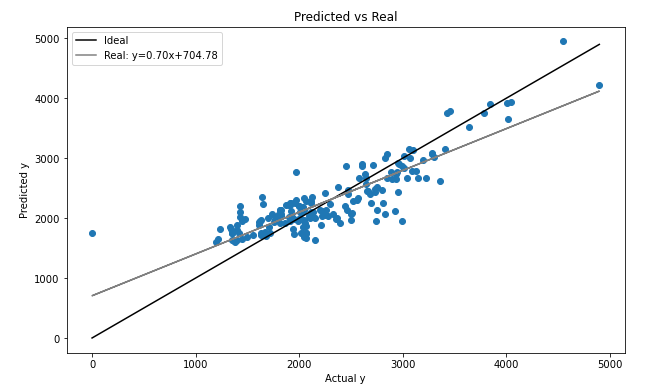
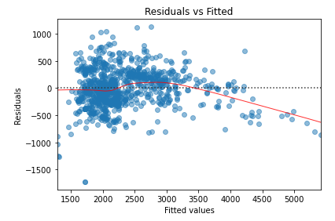
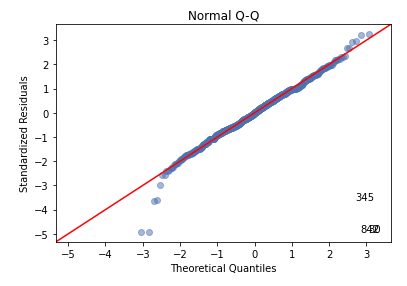
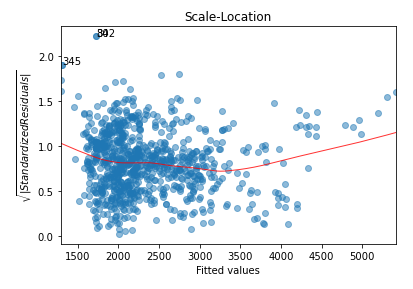
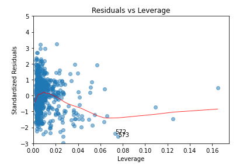
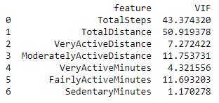

# Weight Loss Tracking

## Project Goals
1. Our primary goal aims to train a linear regression machine learning model which predicts the average daily calorie consumption based on an individual’s average daily activity information, such as daily walking steps, walking distance, very active minutes and so on.
2. Our secondary goal aims to train an ensemble regression learning model given the same dataset to explore how we can combine multiple regression models to improve the accuracy and overall performance of prediction beyong linear regression.
3. Lastly, we hope to create an interactive and engaging atmosphere for our members to share ideas, tell stories, practice ML skills, strengthen leadership, teamwork and communication skills.

## Logo

## Analysis
We built several models to test out which method was the best at capturing the relationship between specific activities and the number of calories burned. During the process, we found that our linear model with 7 predictors had the highest test R^2 of 0.74. Since the scale for each predictor is standardized, we can directly compare the coefficients. The two largest contributors are TotalDistance and TotalSteps which makes sense as they were highly correlated with the target Calories. In the graph, the line for the predicitons is fairly close to the 45 degree line which is what we hoped for.

Going further into the details, we can look at the diagnostic plot to quanitfy the 7-predictor model's performance. In the Residuals vs Fitted graph, we can see that the red line curves near the end however this isn't a serious violation. Next in the Normal Q-Q figure, we expect to see a straight light and for the most part it is until the deviations near the tail. The 3rd plot, Scale-Location, is also supposed to be flat with equally spaced points, but data isn't perfect. Lastly, there's 2 points in the Residuals vs Leverage figure that could be bad leverage. However, when we tried building a model on data with the outliers removed, the R^2 value didn't improve much so we just left it.

Besides those, we also calculated the VIF scores to measure how correlated the predictors were. All of them except VeryActiveMinutes and SedentaryMinutes are very high and this is reflected on the correlation map as well. So this meant that despite our model's relatively high scores, it wasn't our most reliable model.

The reason why we went with a 7 predictor model was because it had the highest R^2 score. Will, one of the data analysts, conducted two tests: AIC and BIC. This is a test where we're trying to find the lowest AIC and BIC scores to determine the ideal number of predictors to include in the model. Both graphs gave similar results, showing the lowest AIC/BIC scores after 7 predictors. Expanding upon this, we decided on 7 instead of 8+ so as to avoid overfitting the model. 

## Contribution
Pull requests are welcome. For major changes, please open an issue first to discuss what you would like to change.
Please make sure to update tests as appropriate.

## License
[MIT](https://choosealicense.com/licenses/mit/)
